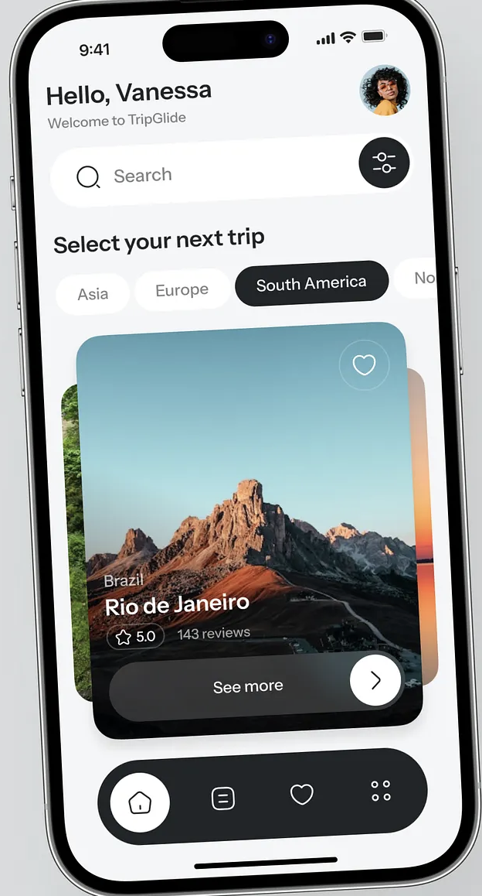
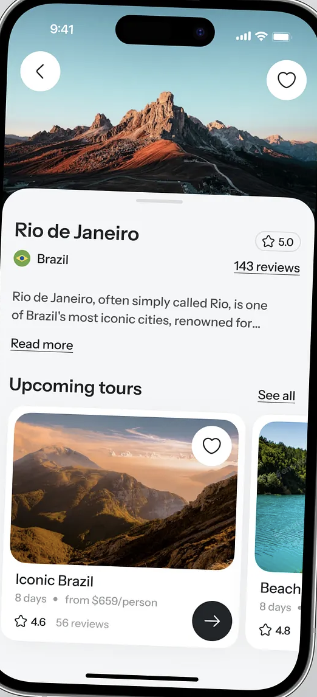

# Pluma: The Badminton Drill Catalog - Design Instructions

## Design System Overview

This document outlines the design principles, components, and guidelines for Pluma, the badminton drill catalog app interface, based on the reference designs.

---

## Reference Images

(Reference/example3.png)

## Vision

**Product Purpose**

An app for badminton drills covering both shot techniques and footwork patterns across different skill levels. The app serves as a structured learning resource for players looking to improve specific aspects of their game through deliberate practice.

**Core Functionality**

Users can browse and access individual drills, each containing a detailed list of step-by-step instructions. The interface prioritizes clarity and focus, allowing players to quickly find relevant drills and understand how to execute them correctly.

**Organization System**

Each drill is tagged with multiple labels that enable filtering by:

- Skill level (beginner, intermediate, advanced)
- Drill type (shot technique, footwork)
- Specific shot category (clear, drop, smash, drive, net shots, etc.)
- Court position (front court, mid court, rear court)
- Training focus (accuracy, speed, stamina, technique)

This tagging system allows users to discover drills that match their current skill level and specific training goals.

**User Journey**

1. Browse drills through filtered or complete lists
2. Select a drill to view
3. Read through sequential instructions
4. Return to browse for next drill

The experience emphasizes minimal friction between discovery and learning, with no unnecessary steps between finding a drill and executing it.

---

## Technical Constraints (Experience-Level)

- The app must be built as a mobile application
- Navigation must use a native bottom tab pattern
- The UI must feel platform-native
- Performance must support smooth scrolling and reading

Implementation details are defined in ARCHITECTURE.md

---

## Design Philosophy

### Core Principles

**1. Inspiration-First Design**
The interface prioritizes beautiful, high-quality imagery that inspires wanderlust. Every visual element should evoke the excitement of travel and discovery. Images are not decorative—they are the primary storytelling medium.

**2. Clarity Through Simplicity**
Complex travel planning is made approachable through clean layouts, generous whitespace, and clear visual hierarchy. Users should never feel overwhelmed by information or options.

**3. Effortless Navigation**
The user journey should feel natural and intuitive. Information architecture follows the user's mental model: discover → explore → detail → book. Each step feels like a logical progression, not a disjointed series of screens.

**4. Trust and Credibility**
Social proof (ratings, reviews) and transparent information build confidence. Details are readily available without being pushy. The design communicates professionalism and reliability.

**5. Tactile and Responsive**
Every interaction should feel immediate and satisfying. Buttons respond to touch, cards provide feedback, and animations acknowledge user actions. The interface should feel alive, not static.

### Visual Language

**Elegance Through Restraint**

- Limited color palette (primarily black, white, and photography)
- Consistent use of rounded corners (24px for cards, creating a soft, approachable feel)
- Typography that breathes with generous line-height and spacing
- Dark UI elements that recede, allowing imagery to take center stage

**Depth and Layering**

- Strategic use of shadows and overlays to create visual hierarchy
- Cards that appear to float above the background
- Gradients that enhance readability without compromising image quality
- Bottom sheets and modals that slide naturally into view

**Photography as Foundation**

- Images drive emotional connection and decision-making
- High-quality, aspirational photography is non-negotiable
- Gradients and overlays ensure text remains readable
- Every image should answer: "Would I want to go there?"

### Design Experience

The experience is structured around clear, predictable navigation and low cognitive load, optimized for quick orientation and intentional exploration. Users should always know where they are, where to go next, and how to return.

Navigation is bottom-tab based, reflecting frequent, repeat usage and thumb-friendly interaction.

**Global Navigation Model**

The application uses three persistent bottom tabs that act as the primary experience pillars.

The bottom navigation must:

- Always remain visible at the top level
- Represent stable mental categories
- Never change order
- Never introduce nested tab bars

The tabs are designed for recognition, not discovery.

**Tab 1: Home**

The Home tab acts as a landing and grounding space.

Purpose:

- Establish the identity and tone of the product
- Provide a calm entry point into the app
- Avoid overwhelming the user with choices

Experience characteristics:

- Minimal interaction
- Minimal decision-making
- Focused on presence rather than action

Home should feel like a starting point, not a dashboard. Users should never feel required to "do" something here.

**Tab 2: Drills**

The Drills tab is the primary exploration surface of the app.

Purpose:

- Allow users to browse and navigate drill-related entries
- Support structured exploration without forcing depth

Experience characteristics:

- List-based or grid-based browsing
- Clear separation between items
- Immediate sense of organization and scope

Users should be able to:

- Scroll comfortably
- Recognize items quickly
- Decide whether to explore deeper without commitment

This tab supports intentional discovery, not urgency.

**Drill Detail Navigation Experience**

Selecting a drill transitions the user into a focused, single-purpose detail view.

Experience characteristics:

- Visual continuity with the Drills tab
- Clear sense of entering a deeper layer
- No competing navigation elements

The detail page should:

- Preserve the overall theme of the app
- Present a large, readable text area as the primary focus
- Balance text density with visual breathing room

The experience should feel immersive but not heavy, allowing the user to stay oriented while engaging more deeply.

Returning to the Drills tab must be:

- Obvious
- One action
- Consistent across all drill entries

**Tab 3: Shots**

The Shots tab functions as a parallel exploration space, not a subset of Drills.

Purpose:

- Provide a distinct category of knowledge
- Maintain a similar exploration rhythm to the Drills tab

Experience characteristics:

- Structural similarity to the Drills tab
- Independent navigation flow
- No cross-dependence required to use it

Users should feel:

- Familiarity in how content is browsed
- Clarity that this is a separate domain
- Confidence navigating without learning a new pattern

**Consistent Depth Model**

Across all tabs:

- Top-level views are lightweight and scannable
- Deeper views are focused and distraction-free
- The number of navigation layers is intentionally limited

Users should never feel "lost in content." Every transition should feel expected and reversible.

**Navigation Principles**

- Bottom tabs represent where you are, not actions
- Tapping a tab always returns to its top-level view
- No hidden navigation paths
- No modal flows that replace primary navigation

The experience prioritizes predictability over cleverness.

---

## Color Palette

### Primary Colors

- **Background**: `#FFFFFF` (White)
- **Primary Text**: `#000000` (Black)
- **Secondary Text**: `#666666` (Gray)
- **Accent Dark**: `#1A1A1A` (Near Black)

### Interactive Elements

- **Selected Pill**: `#1A1A1A` (Dark background with white text)
- **Unselected Pill**: `#F5F5F5` (Light gray background with dark text)
- **Icon Buttons**: `#1A1A1A` (Dark circular backgrounds)

### Status Elements

- **Star Rating**: Gold/Yellow
- **Favorite Heart**: White outline, filled when active

---

## Typography

### Font Family

- Primary: SF Pro Display (iOS Native) or similar sans-serif

### Text Hierarchy

- **H1 (Page Header)**: 32-34px, Bold, Black
- **H2 (Section Title)**: 22-24px, Bold, Black
- **H3 (Card Title)**: 24-26px, Semibold, White (on images) or Black
- **Body Text**: 16-17px, Regular, Black or Dark Gray
- **Caption**: 14-15px, Regular, Gray
- **Button Text**: 16-18px, Semibold, White (on dark) or Black

### Greeting Text

- "Hello, [Name]": 32px, Bold
- "Welcome to Pluma": 16px, Regular, Gray

---

## Layout & Spacing

### Screen Margins

- Left/Right: 20px
- Top: Safe area + 16px
- Bottom: Safe area + 24px

### Component Spacing

- Between major sections: 32-40px
- Between cards: 16-20px
- Within cards: 16px padding
- Search bar margin: 20px horizontal, 16px vertical

### Card Dimensions

- Large destination card: Full width - 40px, ~400px height
- Tour card: Full width - 40px, ~200px height
- Tour card in horizontal scroll: 320px width

---

## Component Guidelines

### Design Principles for Components

**Consistency**
All components follow the same design language. Border radius, spacing, and interaction patterns remain consistent throughout the app. This creates a cohesive experience and reduces cognitive load.

**Modularity**
Components are designed to be reusable and adaptable. A card component can display destinations, tours, or activities with minimal variation. This ensures scalability and maintainability.

**Hierarchy**
Visual weight determines importance. Primary actions use high contrast (dark backgrounds, bold text), secondary actions use lighter treatments, and tertiary actions remain subtle until needed.

**Feedback**
Every interactive element provides immediate visual feedback. Users always know what they've tapped, what's loading, and what's changed. No action should feel unacknowledged.

---

## Components

### Navigation Bar (Bottom)

- **Style**: Fixed bottom bar with rounded top corners
- **Background**: `#1A1A1A` with slight transparency
- **Height**: 80px
- **Border Radius**: 32px (top corners)
- **Icons**: 24x24px, white
- **Active State**: White fill background on icon
- **Layout**: 4-5 icons evenly spaced

**Usage Guidelines:**

- Primary navigation should never exceed 5 items
- Active state should be immediately obvious (filled background circle)
- Icons should be universally recognizable (avoid abstract symbols)
- Always visible except when keyboard is present

**Behavioral Specifications:**

- Smooth transition between states (200ms)
- Slight scale animation on tap (0.95 → 1.0)
- Should not overlap with page content (content ends above it)
- Maintains position during scroll (stays fixed)

### Search Bar

- **Background**: `#F5F5F5`
- **Height**: 48-52px
- **Border Radius**: 24-26px (fully rounded)
- **Icon**: Magnifying glass, 24px, left-aligned
- **Placeholder**: "Search", 16px, Gray
- **Right Element**: Filter/settings icon button

**Usage Guidelines:**

- Appears at top of discovery/browse screens
- Tapping opens full search experience
- Filter button only appears when filters are available
- Placeholder text should be context-specific

**Behavioral Specifications:**

- Tap expands to focus state with keyboard
- Cancel button appears when active
- Recent searches or suggestions appear below
- Smooth transition to dedicated search screen

### Category Pills

- **Default State**:

  - Background: `#F5F5F5`
  - Text: `#000000`
  - Border Radius: 24px
  - Padding: 12px 24px
  - Font: 16px, Medium

- **Selected State**:

  - Background: `#1A1A1A`
  - Text: `#FFFFFF`
  - Same dimensions as default

- **Layout**: Horizontal scroll, 12px gap between pills

**Usage Guidelines:**

- Use for filtering content (continents, categories, dates)
- First pill can be "All" or most popular category
- Keep labels short (1-2 words maximum)
- Show 2.5-3 pills on screen to indicate scrollability

**Behavioral Specifications:**

- Smooth scroll with momentum
- Selected pill animates to dark background (150ms)
- Content below updates when selection changes
- Pill width adjusts to content (min 80px, max 160px)

### Destination Card (Large)

- **Image**: Full card coverage with gradient overlay at bottom
- **Border Radius**: 24px
- **Overlay**: Dark gradient from transparent (top) to 60% black (bottom)
- **Heart Icon**: Top right, 40px from top, 32px from right, white outline
- **Content Area**: Bottom 120px
  - Location label: "Brazil", 16px, White, top of content
  - Title: "Rio de Janeiro", 28px, Bold, White
  - Star rating: 20px star icon + "5.0" text
  - Review count: "143 reviews", 14px, Light gray
- **CTA Button**:
  - Text: "See more"
  - Right-aligned with arrow icon
  - Semi-transparent dark background
  - Border Radius: 24px
  - Padding: 12px 20px

**Usage Guidelines:**

- Primary discovery element on home screen
- Image should be high-quality hero shot of destination
- Heart icon for saving/favoriting (toggle state)
- "See more" leads to destination detail page

**Behavioral Specifications:**

- Card scales down slightly on tap (0.98)
- Heart animates on tap (pulse and fill)
- Gradient ensures text is always readable
- Swipe gesture for next/previous destination
- Parallax effect on scroll (optional enhancement)

**Content Requirements:**

- Hero image: 2x resolution minimum, 16:10 aspect ratio
- Destination name: Maximum 24 characters
- Rating: Only show if 10+ reviews exist
- Location: Country or region name only

### Destination Detail Header

- **Image**: Full-width hero image with back button and heart icon overlay
- **Height**: ~40% of screen
- **Overlay Buttons**:
  - Background: White circle
  - Size: 48px diameter
  - Icons: 24px, black
  - Position: 20px from edges, 60px from top

**Usage Guidelines:**

- Creates immersive first impression of destination
- Back button: Always top-left for consistency
- Heart button: Top-right for favoriting
- Image should pan subtly on scroll (parallax)

**Behavioral Specifications:**

- Image scales down as user scrolls down
- Overlay buttons remain fixed during scroll
- Header collapses to minimal state with title
- Smooth transition between expanded and collapsed states

### Detail Card Content

- **Background**: White
- **Border Radius**: 32px (top corners only)
- **Overlap**: -40px over image
- **Padding**: 24px
- **Title**: 28px, Bold, Black
- **Location**: 16px with flag emoji, Gray
- **Rating**: Right-aligned, 20px star + "5.0"
- **Review Link**: Underlined, 16px, clickable
- **Description**: 16px, Regular, Line height 1.5

**Usage Guidelines:**

- Appears to float over hero image
- Contains all essential information about destination
- "Read more" expands truncated descriptions
- Links to reviews are always actionable

**Behavioral Specifications:**

- Pulls up over hero image (overlaps by 40px)
- Shadow provides depth perception
- Description truncates at 3 lines with "Read more"
- "Read more" expands inline (no page navigation)
- Smooth scroll throughout content area

### Tour Card (Horizontal Scroll)

- **Dimensions**: 320px width × 320px height
- **Border Radius**: 20px
- **Image**: Top 60% of card
- **Heart Icon**: Top right of image, white circle background
- **Content Padding**: 16px
- **Tour Title**: 20px, Semibold
- **Duration**: "8 days", 14px, Gray
- **Price**: "from $659/person", 14px, Gray
- **Rating**: Star icon + "4.6" + review count
- **Arrow Button**: Bottom right, dark circle, 48px

**Usage Guidelines:**

- Displays available tours within destinations
- Horizontal scroll allows browsing multiple options
- Price shown as "from" to indicate starting point
- Duration clearly stated for planning purposes

**Behavioral Specifications:**

- Smooth horizontal scroll with snap-to-grid
- Card scales slightly on tap (0.98)
- Heart toggles saved state with animation
- Arrow button navigates to tour detail
- Shows 1.2 cards on screen to indicate more content

**Content Requirements:**

- Image: 4:3 aspect ratio, shows tour highlight
- Title: Maximum 40 characters, describes tour essence
- Duration: Format as "X days" or "X days/Y nights"
- Price: Always show currency and "per person"
- Rating: Only display if 5+ reviews

### Tour Schedule Card

- **Background**: `#F5F5F5`
- **Border Radius**: 16px
- **Padding**: 16px
- **Layout**: Horizontal with thumbnail + content + expand icon
- **Thumbnail**: 64px × 64px, Border Radius: 12px
- **Day Label**: "Day 1", 14px, Gray
- **Activity Title**: 18px, Semibold, Black
- **Expand Icon**: Chevron, 24px, right-aligned

**Usage Guidelines:**

- Shows daily itinerary in tour detail view
- Expandable to reveal full day schedule
- Thumbnail provides visual preview of day's highlight
- Day label creates clear chronological structure

**Behavioral Specifications:**

- Tap anywhere on card to expand
- Chevron rotates 180° when expanded (200ms)
- Expanded state shows full day details with smooth animation
- Collapse animation reverses expansion
- Only one card expanded at a time (accordion pattern)

**Expanded State:**

- Shows time-based breakdown (Morning, Afternoon, Evening)
- Each time period lists activities
- Maintains same styling with increased height
- Smooth height transition (300ms ease-in-out)

### Tab Navigation (Horizontal)

- **Selected Tab**:

  - Background: `#1A1A1A`
  - Text: White
  - Border Radius: 20px
  - Padding: 10px 20px

- **Unselected Tab**:
  - Background: Transparent
  - Text: Gray
  - Same dimensions

**Usage Guidelines:**

- Switches between different views of same content
- Maximum 4 tabs for optimal usability
- Labels should be concise (1-2 words)
- First tab typically default/most important

**Behavioral Specifications:**

- Smooth transition between selected states (150ms)
- Content below cross-fades when switching (300ms)
- Indicator animates position when tab changes
- Equal spacing between all tabs

### Buttons

#### Primary CTA (Book a tour)

- **Background**: `#1A1A1A`
- **Text**: White, 18px, Semibold
- **Border Radius**: 28px
- **Height**: 56px
- **Width**: Full width - 40px margin
- **Position**: Fixed or sticky at bottom

**Usage Guidelines:**

- Primary action on screen (booking, confirming)
- Always visible when relevant
- Text should be action-oriented and clear
- Use sparingly (one per screen maximum)

**Behavioral Specifications:**

- Scales down on press (0.95)
- Disabled state: 40% opacity, no interaction
- Loading state: Shows spinner, text dims
- Success state: Checkmark animation
- Should lift above other content (elevation)

#### Secondary Button (See more)

- **Background**: Semi-transparent dark (rgba(0,0,0,0.5))
- **Text**: White, 16px, Medium
- **Border Radius**: 24px
- **Padding**: 12px 20px
- **Right Icon**: Arrow, 20px

**Usage Guidelines:**

- Secondary actions (viewing details, expanding content)
- Can appear within cards or content areas
- Arrow indicates navigation to new screen
- Multiple secondary buttons acceptable on same screen

**Behavioral Specifications:**

- Subtle scale on press (0.96)
- Arrow slides right slightly on press (4px)
- Transitions to new screen with slide animation
- Hover state (web): Background darkens to 70% opacity

---

## Interactions & Animations

### Card Interactions

- **Tap**: Scale down to 0.98 with subtle shadow increase
- **Scroll**: Smooth horizontal/vertical scrolling with momentum
- **Image Load**: Fade-in transition, 200ms

### Button Interactions

- **Tap**: Scale to 0.95, 100ms
- **Release**: Scale back to 1.0, 150ms ease-out
- **Disabled**: 40% opacity, no interaction

### Navigation

- **Tab Switch**: Cross-fade content, 300ms
- **Page Transition**: Slide from right (push), slide to right (pop)
- **Modal Present**: Slide up from bottom with backdrop fade

### Heart/Favorite

- **Tap**: Scale pulse (1.0 → 1.2 → 1.0), 400ms
- **Fill**: Animate from outline to solid with color transition

---

## Image Guidelines

### Quality Standards

- **Resolution**: 2x-3x for retina displays
- **Format**: JPG for photos, PNG for icons
- **Optimization**: Compressed but maintain visual quality
- **Aspect Ratios**:
  - Destination cards: 16:10
  - Tour cards: 4:3
  - Detail hero: 16:9

### Image Treatment

- **Overlay**: Dark gradient on cards (0-60% black)
- **Corner Radius**: Match parent container
- **Loading State**: Gray placeholder with subtle pulse animation

---

## Iconography

### Icon Style

- **Type**: Line icons, 2px stroke weight
- **Size**: 24px standard, 20px small, 32px large
- **Color**: Match parent component (usually white on dark, black on light)

### Common Icons

- Search: Magnifying glass
- Favorite: Heart (outline/filled)
- Filter: Sliders/adjustments
- Home: House outline
- List: Three horizontal lines
- More: Four dots in grid
- Back: Left chevron
- Forward: Right chevron
- Expand: Down chevron
- Star: Filled star for ratings

---

## Accessibility

### Touch Targets

- **Minimum**: 44x44px for all interactive elements
- **Recommended**: 48x48px for primary actions
- **Spacing**: Minimum 8px between adjacent interactive elements

### Contrast Ratios

- **Text on white**: 4.5:1 minimum (WCAG AA)
- **White text on dark**: 7:1 preferred
- **Text on images**: Use overlay gradient for readability
- **Interactive elements**: 3:1 contrast with background

### Text Sizing

- Support dynamic/scalable text sizes
- Minimum body text: 16px
- Maintain relative sizing with user preferences
- Test layouts at 200% text scale

### Screen Reader Support

- All interactive elements need descriptive labels
- Image alt text should describe destination/scene
- Form inputs require associated labels
- Status changes announced to screen readers

### Focus States

- Visible focus indicators for keyboard navigation
- Focus order follows logical reading flow
- Skip navigation links for main content
- No focus traps in modals

---

## Responsive Behavior

### Adaptive Layouts

**Small Screens (320-375px width)**

- Single column layouts throughout
- Reduce horizontal margins to 16px
- Scale card sizes proportionally
- Stack navigation items if needed
- Reduce font sizes by 1-2px

**Medium Screens (375-428px width)**

- Standard layout as documented
- Optimal for single-hand use
- Cards fill width with 20px margins

**Large Screens (428px+ width)**

- Increase card sizes proportionally
- Maintain 20-24px margins
- Consider showing more content in cards
- Horizontal scrolling cards can show 1.5-2 items

**Tablet/Desktop Considerations**

- Two-column grid for destination cards
- Wider max-width for content (768px)
- Side-by-side layouts for detail pages
- Larger touch targets remain (for touchscreen)

### Orientation Handling

**Portrait (Primary)**

- Vertical scrolling emphasis
- Single column content
- Bottom navigation visible
- Standard card layouts

**Landscape**

- Horizontal space utilization
- Consider side navigation for tablets
- Wider cards with more content visible
- Adjust image aspect ratios if needed

### Content Reflow

- Text wraps naturally at all widths
- Images scale proportionally
- Maintain aspect ratios
- Cards stack vertically when space constrained
- Horizontal scrolls remain horizontal at all sizes

---

## Motion & Timing

### Animation Durations

- **Fast**: 150-200ms (micro-interactions)
- **Standard**: 300ms (transitions)
- **Slow**: 400-500ms (emphasis animations)

### Easing Functions

- **Standard**: ease-in-out
- **Enter**: ease-out
- **Exit**: ease-in
- **Bounce**: Custom spring animation for favorites

---

## Best Practices

### Design Consistency

1. **Spacing System**: Use multiples of 4px (4, 8, 12, 16, 20, 24, 32, 40)
2. **Border Radius**: Maintain 24px for cards, 20-28px for buttons
3. **Shadows**: Subtle elevation (0 2px 8px rgba(0,0,0,0.1))
4. **Whitespace**: Use generous padding (20-24px) for breathing room

### Content Strategy

1. **Imagery**: Always use high-quality, aspirational travel photography
2. **Copy**: Keep microcopy concise and action-oriented
3. **Hierarchy**: Use size, weight, and color to establish clear visual hierarchy
4. **Scannability**: Design for quick browsing and decision-making

### Interaction Patterns

1. **Feedback**: Provide immediate visual feedback for all interactions
2. **Loading**: Show skeleton screens or subtle animations during data loading
3. **Errors**: Use inline messages with clear recovery actions
4. **Success**: Confirm actions with brief, celebratory feedback

### State Management

1. **Empty States**: Include illustrations and helpful, encouraging copy
2. **Error States**: Explain what happened and how to fix it
3. **Loading States**: Never leave users wondering if something is happening
4. **Success States**: Acknowledge completion without disrupting flow

### Content Guidelines

1. **Destination Names**: Use official names, proper capitalization
2. **Prices**: Always include currency symbol and "per person" context
3. **Dates**: Use relative dates when recent (Today, Yesterday) and absolute dates otherwise
4. **Reviews**: Only show ratings with 5+ reviews for credibility
5. **Descriptions**: First 2-3 lines should capture essence; use "Read more" for details

---

_Last Updated: December 2025_
