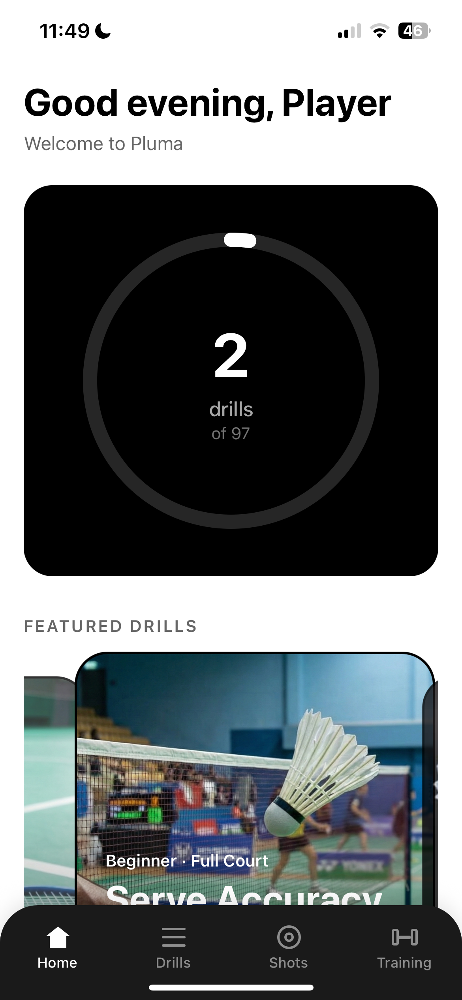
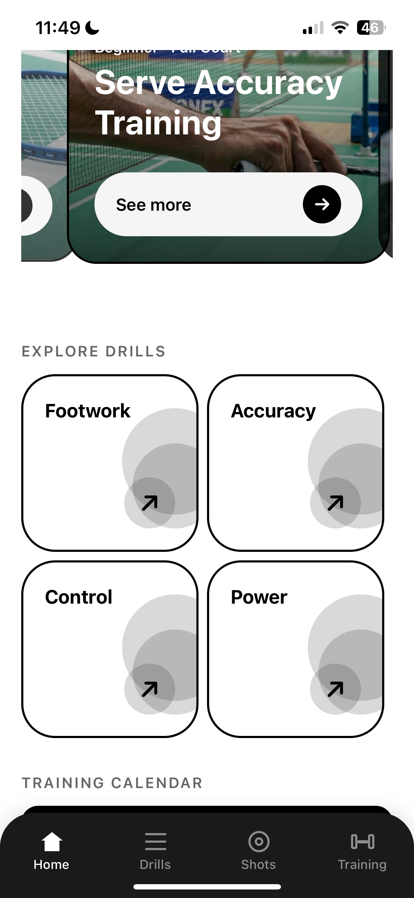
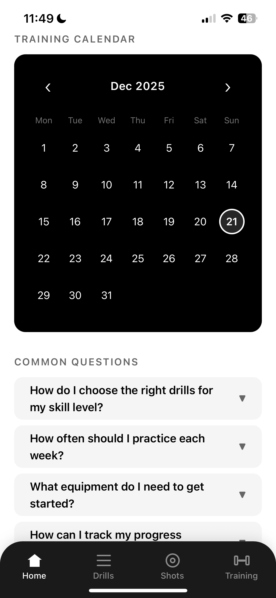
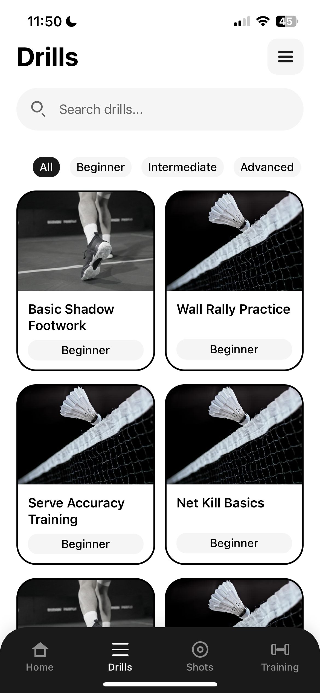
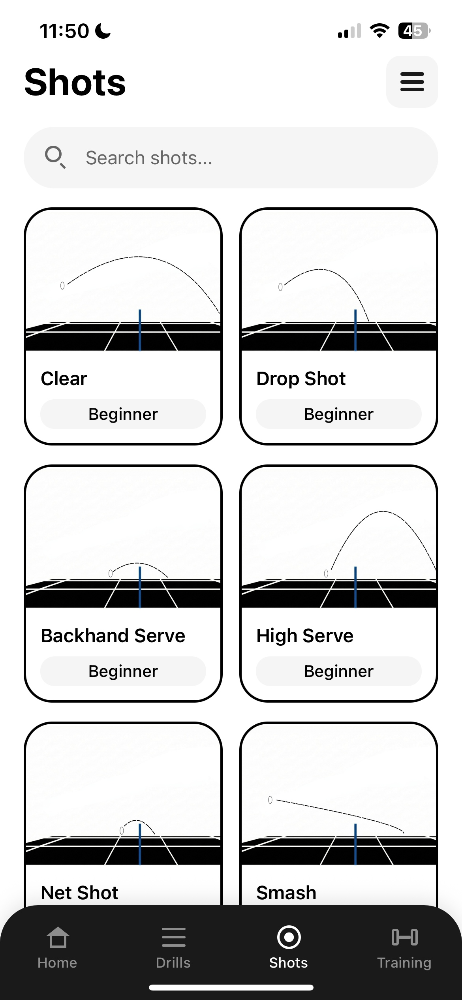
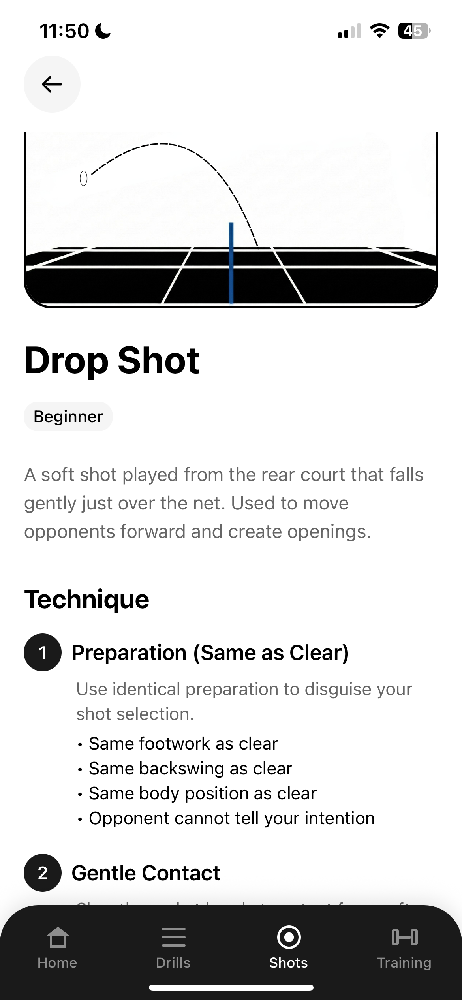
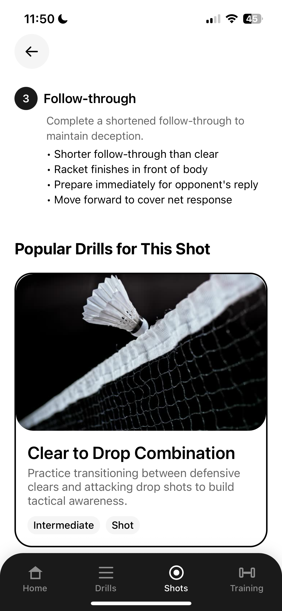
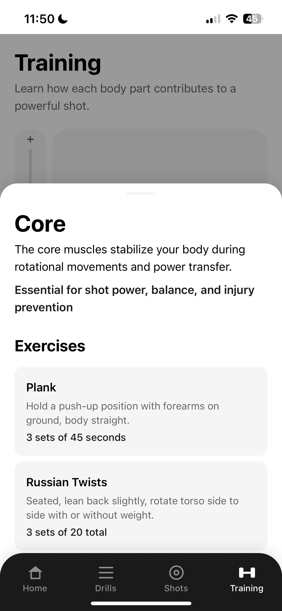

<div align="center">
  
</div>

A comprehensive badminton drill catalog and training companion app built with React Native and Expo. Pluma helps badminton players of all skill levels improve their game through structured drills, shot techniques, and interactive 3D training visualizations.

<p align="center">
  
  
  
  
</p>

<p align="center">
  
  
  
  
</p>

## ✨ Features

### 🎯 Drill Catalog

- **Extensive Drill Library**: Browse 97+ badminton drills covering footwork, shots, and techniques
- **Smart Filtering**: Filter by skill level (beginner, intermediate, advanced), drill type, shot category, court position, and training focus
- **Grid & List Views**: Toggle between compact grid layout and detailed list view
- **Detailed Instructions**: Step-by-step instructions for each drill with visual guidance
- **Search Functionality**: Quickly find specific drills

### 📊 Progress Tracking

- **Drill Completion Tracker**: Circular progress indicator showing drills completed
- **Training Calendar**: Visual calendar displaying drill completion history with white rings marking active training days
- **Persistent Stats**: All progress data saved locally and synced across app sessions
- **Monthly View**: Navigate through different months to review training history

### 🏋️ Training Features

- **Interactive 3D Model Viewer**: Explore badminton training positions with interactive 3D models
- **Muscle Group Guidance**: Tap on body parts to get targeted training tips
- **Gesture Controls**: Rotate, zoom, and pan 3D models with intuitive touch gestures
- **Zoom Slider**: Precise zoom control with vertical slider

### 🎾 Shot Techniques

- **Shot Library**: Comprehensive catalog of badminton shots with detailed breakdowns
- **Technique Guides**: Learn proper form and execution for each shot type
- **Visual References**: High-quality images demonstrating shot techniques

### 🏠 Home Dashboard

- **Personalized Greeting**: Time-based welcome messages
- **Featured Drills**: Curated drill recommendations in a sliding card interface
- **Quick Categories**: Fast access to drill categories (Footwork, Accuracy, Control, Power)
- **FAQ Section**: Common questions and answers about badminton training

## 🛠 Tech Stack

### Core Framework

- **React Native** - Cross-platform mobile development
- **Expo SDK 54** - Development platform and tooling
- **TypeScript** - Type-safe development
- **React 19** - Latest React features

### Navigation & Routing

- **React Navigation v7** - Native stack and bottom tab navigation
- **@react-navigation/native-stack** - Stack navigator
- **@react-navigation/bottom-tabs** - Bottom tab navigation

### State Management

- **Zustand** - Lightweight state management for global app state
- **@tanstack/react-query v5** - Server state management and caching
- **React Context API** - Provider pattern for drill tracking and favorites

### Data Persistence

- **@react-native-async-storage/async-storage** - Local storage for user data
- **Zustand Persist Middleware** - Automatic state persistence

### 3D Graphics & Animation

- **Three.js** - 3D model rendering and visualization
- **Expo GL** - OpenGL ES bindings for React Native
- **GLTFLoader** - Load and parse .glb 3D model files
- **Expo Asset** - Asset management and loading

### UI & Animations

- **React Native Reanimated v3** - High-performance animations
- **React Native Gesture Handler** - Native gesture recognition
- **Expo Vector Icons** - Icon library
- **React Native Safe Area Context** - Safe area handling for notches

### Development Tools

- **Jest** - Testing framework
- **ESLint** - Code linting
- **TypeScript** - Static type checking
- **Expo Dev Client** - Enhanced development experience


## 🚀 Getting Started

### Prerequisites

- Node.js 18+
- npm or yarn
- Expo CLI
- iOS Simulator (Mac only) or Android Emulator

### Installation

1. Clone the repository:

```bash
git clone https://github.com/yourusername/pluma.git
cd pluma/Pluma
```

2. Install dependencies:

```bash
npm install
```

3. Start the development server:

```bash
npx expo start
```

### Local Persistence

- Uses Zustand with AsyncStorage for persistent state
- Automatic state hydration on app launch
- Version-based migration system for schema updates

### Calendar Tracking

- Tracks drill completion by date (YYYY-MM-DD format)
- Visual indicators (white rings) on completed days
- Month navigation with swipe gestures

### 3D Model Viewer

- Loads .glb files using Three.js
- Interactive gesture controls for rotation and zoom
- Mesh-based selection for muscle group training tips
- Optimized rendering performance

### Drill Filtering

- Multi-criteria filtering system
- Real-time filter updates
- URL-based deep linking to filtered views

## 🤝 Contributing

Contributions are welcome! Please follow these guidelines:

1. Fork the repository
2. Create a feature branch (`git checkout -b feature/AmazingFeature`)
3. Commit your changes (`git commit -m 'Add some AmazingFeature'`)
4. Push to the branch (`git push origin feature/AmazingFeature`)
5. Open a Pull Request

## 📄 License

This project is licensed under the MIT License - see the [LICENSE](LICENSE) file for details.

**Built with ❤️ for badminton players everywhere**
